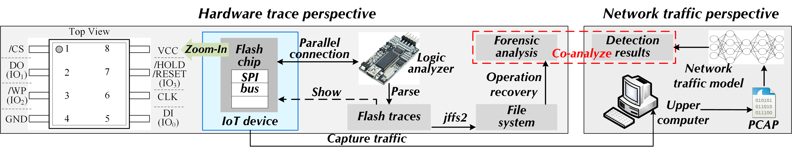
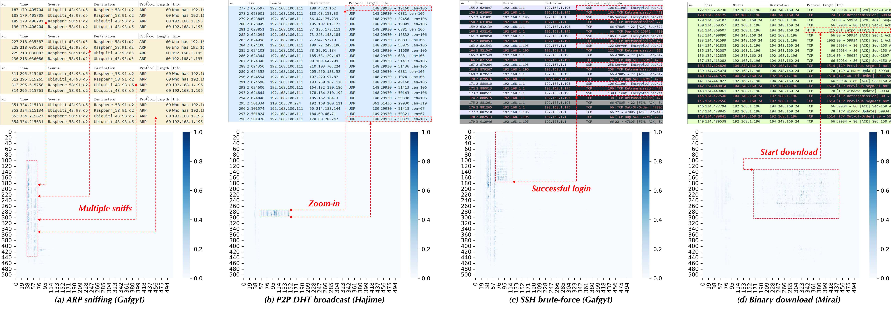

# TMC_CMD

**CMD: Co-analyzed IoT Malware Detection and Forensics via Network and Hardware Domains**



## Introduction

CMD is a co-analyzed IoT malware detection and forensics system that combines network and hardware perspectives. 
From network-side traffic identification, CMD realizes to capture contextual semantics from cross-sources flows. 
From the host-side SPI traces analysis, CMD achieves a side-channel-manner log recovery for on-chip operations. 
This anonymous repository shows part source code including the model architecture and file operation recovery process implementation. 

## Requirements

```bash
pip install scipy
pip install numpy
pip install pandas
pip install tqdm
pip install pyecharts
pip install joblib
pip install pickle
pip install sklearn
```

## Hardware

- W25Q128FV Flash chip: [W25Q128FV Datasheet](https://www.pjrc.com/teensy/W25Q128FV.pdf)

## Scripts

The feature production is stored in ./traffic_iden/feature_map.py. 

The model architecture is stored in ./traffic_iden/cap_model.py. 

The code of flash data processing is stored in ./flash_processing/. 

The code of log recovery is stored in ./log_recovery/. 

## Model Interpretability

- Captum: [Captum: Model Interpretability for PyTorch](https://captum.ai/)
  - e.g., Attribution map

## Interpretability Instances

The attribution matrix generation refers to the Integrated Gradients method from Captum. 

The ./eval/png/ stores some interpretability cases for multi-stage malware infection. 



### References
- [Kitsune: An Ensemble of Autoencoders for Online Network Intrusion Detection](https://arxiv.org/abs/1802.09089), Yisroel Mirsky, Tomer Doitshman, Yuval Elovici, and Asaf Shabtai - NDSS 2018
- [Realtime Robust Malicious Traffic Detection via Frequency Domain Analysis](https://dl.acm.org/doi/10.1145/3460120.3484585), Chuanpu Fu, Qi Li, Meng Shen, and Ke Xu - CCS 2021
- [FS-Net: A Flow Sequence Network For Encrypted Traffic Classification](https://ieeexplore.ieee.org/document/8737507), Chang Liu, Longtao He, Gang Xiong, Zigang Cao, and Zhen Li - INFOCOM 2019
- [FlowLens: Enabling Efficient Flow Classification for ML-based Network Security Applications](https://www.ndss-symposium.org/ndss-paper/flowlens-enabling-efficient-flow-classification-for-ml-based-network-security-applications/), Diogo Barradas, Nuno Santos, Luís Rodrigues, Salvatore Signorello, Fernando M. V. Ramos, André Madeira - NDSS 2021
- [Mousika: Enable General In-Network Intelligence in Programmable Switches by Knowledge Distillation](https://ieeexplore.ieee.org/document/9796936/), Guorui Xie, Qing Li, Yutao Dong, Guanglin Duan, Yong Jiang, Jingpu Duan - INFOCOM 2022
- [FlowPic: Encrypted Internet Traffic Classification is as Easy as Image Recognition](https://ieeexplore.ieee.org/document/8845315), Tal Shapira, Yuval Shavitt - INFOCOM Workshops 2019
- [ET-BERT: A Contextualized Datagram Representation with Pre-training Transformers for Encrypted Traffic Classification](https://dl.acm.org/doi/10.1145/3485447.3512217), Xinjie Lin, Gang Xiong, Gaopeng Gou, Zhen Li, Junzheng Shi, Jing Yu - WWW 2022
